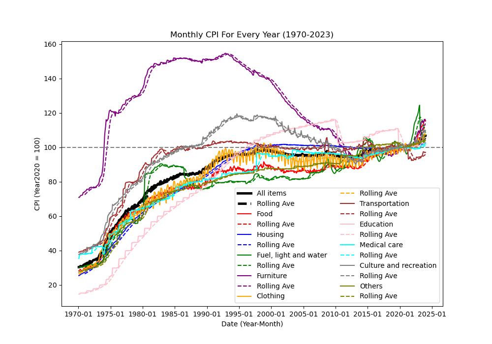
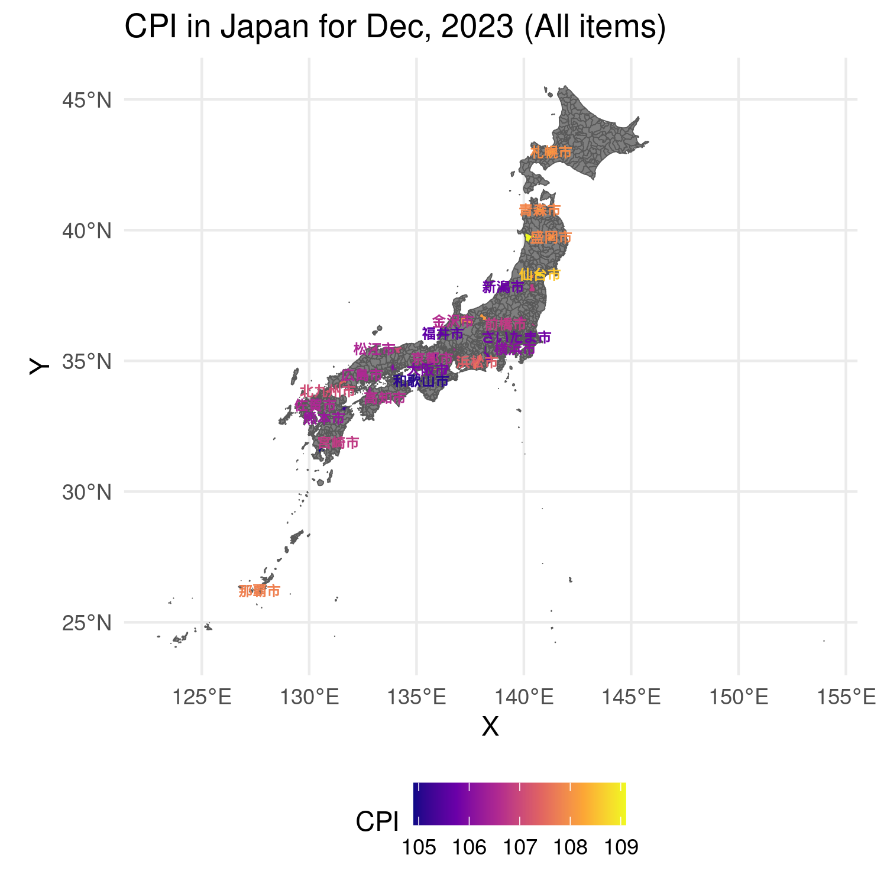

```{r setup, include=FALSE}
knitr::opts_chunk$set(echo = TRUE)
```


# Introduction

The primary objective of this report is to analyze the Consumer Price Index (CPI) of Japan. 
The CPI is a statistical estimate constructed using the prices of a sample of representative items whose prices are collected periodically,
which is used to assess price changes associated with the cost of living. 

I have been living in Japan for almost 2 years, and the price of foods and energy (i.e., gas and electricity) keeps increasing.
So I am interested in the CPI of Japan and want to know the trend of the CPI and the main factors that affect the CPI(the value of japanese yen). My research questions are:

-  a) What is the trend pattern of the CPI of Japan?; b) Which category has the most rapidly increasing price?; c) What is the relationship between the value of Japanese yen and the CPI?; d) Which main city in Japan has the highest CPI in year 2023?

# Data

To do this, I used the database for [CPI](https://www.stat.go.jp/data/cpi/index.html) from the Japan Statistics Bureau.
I used 2 files downloaded from the [website](https://www.e-stat.go.jp/stat-search/files?page=1&layout=datalist&toukei=00200573&tstat=000001150147&cycle=1&year=20230&month=24101212&tclass1=000001150149&tclass2val=0).

-  One contains the CPI of Japan from 1970 Jan to 2023 Dec by month and by category, saved as `cpi_all.csv` inside `janpancpi` folder.

-  The other contains the CPI of Japan by main cities and regions in Japan for only 2023 Dec, saved as `cpi_region.csv` inside `janpancpi` folder. 
  
Besides, I downloaded the exchange rate of Japanese yen to US dollar from 1971 to 2023 from the [website](https://www.macrotrends.net/2550/dollar-yen-exchange-rate-historical-chart).
I named it as `exchange_rate.csv` inside `janpancpi` folder.

# Method

4 graphs were made with above data to answer the research questions.

-  The 1st graph is the trend of the CPI of Japan from 1970 to 2023, monthly by categories (e.g. food, fuel, light and water charges, etc), by data from `cpi_all.csv`.

-  The 2nd graph is the trend of the exchange rate of Japanese yen to US dollar from 1971 to 2023, monthly, by data from `exchange_rate.csv`.

-  The 3rd graph is the scatterplot between the value of Japanese yen and the CPI of Japan from 1971 to 2023, by data from `cpi_all.csv` and `exchange_rate.csv`.

-  The 4nd graph is map of japan with the CPI of main cities in 2023 Dec, by data from `cpi_city.csv` to make this graph.

All codes, data, plots and report would be found on the server `/home/xzhai/dataproc2023/myproject`.


## Procedure

**NOTE:** 

Need to copy and change the directory to `SOME_PATH/myproject` or run inside the directory `SOME_PATH/myproject` using following codes
 (as I use relavent path to read data and save plots).

### Read and clean the data (python)

Using `pandas` in python to read these 3 csv files, saved as the `readdata.py` in `/home/xzhai/dataproc2023/myproject`.

For `cpi_all.csv` (all historical data from 1970 to 2023 for Japan):

1.  Confirm the index of year and month, drop rows and columns before this value.
2.  Seperate year and month into 2 columns by one column for year and month characters, and turn to date formate. 
3.  Substract a dataframe for category names of price groups.
4.  Repalce the col names using names in category.
5.  After above steps, set the first row to header and save data as `mycpiall.csv` in `/home/xzhai/dataproc2023/myproject`.

For `cpi_city.csv` (only 2023 Dec data for main cities in Japan):

1.  Similarly, Confirm the index of "年月(year and month)", drop rows and columns before this value.
2.  I only need absolute value of the CPI, so I drop the all columns with % value by categories.
3.  Fill all region code column to 5 digital numbers with 0 before each.
4.  Replace the col names using names in category.
5.  Finally, save data as `mycpicity.csv` in `/home/xzhai/dataproc2023/myproject`.

For `exchange_rate.csv` (exchange rate of Japanese yen to US dollar from 1971 to 2023):

1.  Drop unneed lines and only keep "date" and "value".
2.  Separate date into 3 columns(year,month,day) by the column "date" (easy for me to conpute mean by year and month).
3.  Finally, save data as `myexrate.csv` in `/home/xzhai/dataproc2023/myproject`.


### Read and plot the data (python)

Using `matplotlib` in python to plot the data. the code was saved as `plot.py` in `/home/xzhai/dataproc2023/myproject`.

For `mycpiall.csv`: (plot saved as `figure1.png`)

1.  Read the data and add a new column "date" to store the year of each data and columns for rolling average.
2.  Plot the trend of the CPI of Japan from 1970 to 2023, monthly by 10 main categories (e.g. all, food, housing, light and water charges, etc).
    -  there are more detailed categories in dataframe, and I only plot the 10 main upper categories to summerize the data.
3.  The rolling mean of 12 months(dashed line) was used to smooth the trend.
4.  Add a horizontal line to show the same value of the CPI in Year 2020.

For `myexrate.csv`: (plot saved as `figure2.png`)

1.  Read the data and `resample` the data by month to let it be same time scale as CPI data.
2.  Similarly, plot the change of the value of Japanese yen to US dollar from 1971 to 2023, monthly.


For scatterplot, (plot saved as `figure3.png`)

1.  I extracted the data of the CPI of Japan of "all" group and the exchange rate of Japanese yen to US dollar from 1971 to 2023, and merge them into one dataframe. 
2.  Plot the scatterplot between the value of Japanese yen and the CPI of Japan colored by year.
3.  Add points for the year 1990, 1995, 2020 and 2023 to see the change of the value of Japanese yen and the CPI of Japan.


### Read and plot the data (R)

Use `ggplot2` in R to plot the map of japan with CPI. The code and plot was saved as `map.R` and `figure4.png` on server.

Use the `mycpicity.csv` to plot the map of Japan with the CPI (only all items) of main cities in 2023 Dec.

1. Find the coordinates of the main cities in Japan.
    -  I find the coordinates (lons and lats) of all japanese city could be acquired from "GADM" by `getData` function in `raster` package.
    -  I downloaded and assign a dataframe ('sf' object for geodata) for the coordinates of the main cities in Japan.
2.  Add the CPI of main cities in Japan to this dataframe using `merge` fun.
    -  I didnot remove the lines/cites without CPI data, so the map shape of Japan would be kept and the plot would be more clear. 
3.  Plot the map of Japan with the CPI of main cities in 2023 Dec by `geom_sf`.
    -  Use "plasma" color scale to show the CPI value.  
4.  Add the city name as text to the map by `geom_text`.
    -  As I am not formilar with the Japanese city position on map, so I add the city name for the my plot.
    -  To do that, I need the coordinates as number not the "geometry" object, so I use `st_coordinates` to get the coordinates of the cities.
    -  And I also get the "city" names as vector with not `NA` cpi values.
    -  Finally, I build a new dataframe for the city names and coordinates, and add it to the map by `geom_text`.


### Upload the data and plots to the server

Finally, I use winscp to upload all data, codes, plots and this report to the server `/home/xzhai/dataproc2023/myproject`.


# Results and Discussion

## Trend of the CPI of Japan from 1970 to 2023

```{r , echo=FALSE, out.width = '80%'}

```

The trend of the CPI of Japan from 1970 to 2023 is shown in Figure1.
Basical the prices kept stable for amost 25 years, and increased again just recently.

It is very interested to see that the CPI of Japan for all items (black line) first increased rapidly from 1970 to around 1995 (about 25 years), 
then keep stable from 1995 to 2020 (another 25 years), and increased again just recently.
The first period for increased rapidly is called "bubble economy" in Japan, and the second period for stable is called "lost decade" in Japan.

Clothing (orange line), housing (blue line), medicalcare (cyan line) 
and transportation (brown line) shared the similar trend with all items.
However, the food (red line) and fuel, light and water charges (green line) have the most rapidly increasing price in the recent years. 

On the other hand, furniture (purple line), recreation (gray line) reached their peak around 1990s and decreased after that.
Interestingly, education (pink line) declined recently, which may be due to the COVID-19 and relaxing attitude.


## Trend of the exchange rate of Japanese yen to US dollar from 1971 to 2023

```{r , echo=FALSE, out.width = '50%', fig.show='hold'}
knitr::include_graphics(c("figure2.png", "figure3.png"))
```


The trend of the exchange rate of Japanese yen to US dollar from 1971 to 2023 is shown in Figure2.
This value is the number of Japanese yen that can be exchanged for one US dollar.
With the higher value, the Japanese yen is weaker.
Thus we could see the first peak of JSY is around 1995 corresponding with the rapid increasing of CPI and the price peak for entertrainment.
And since 2020, the value of JSY keep decreasing again.

## Scatterplot between the value of Japanese yen and the CPI of Japan from 1971 to 2023

To further explore the relationship between the value of Japanese yen and the CPI of Japan,
scatterplot between the value of Japanese yen and the CPI of Japan from 1971 to 2023 is shown in Figure3.

A clear negative linear relationship between the value of exchange rate and the CPI of Japan is observed.
In other words, the value of Japanese yen is positively correlated with the CPI of Japan. (lowing exchange rate, higher JPY value, higher CPI)

I annotated the points for the year 1990, 1995, 2020 and 2023 to see the change of the value of Japanese yen and the CPI of Japan.
After year 1990, those points have already moved to the up-left conner and basically been staying there until recently. 
In my opinion, the up-right conner is the most dangerous area for the economy, which means the price is high and the value of currency is low.
Thus, the recent trend might be a little dangerous.

## Map of Japan with the CPI of main cities in 2023 Dec

```{r , echo=FALSE, out.width = '100%', out.height='65%'}

```

The map of Japan with the CPI (for all items) of main cities in 2023 Dec is shown in Figure4.

More yellow color means higher CPI value, which means higher price.
We could see that the cities with higher CPI are mainly in the 2 sides(both north and south) of Japan, 
and the cities in the middle of Japan have relatively lower CPI.

In my oponions, the cities with higher CPI might be the remote area,
where the transportation cost is high and the density of population is low.
The increasing price might have more impact on the people living in those cities.

On the other hand, the cities with lower CPI might be the main cities, 
where the indrustrial and commercial activities are more active and the density of population is high.


# Conclusion

After almost 25 years stable, the CPI of Japan increased again just recently.
And the food and fuel, light and water charges have the most rapidly increasing price.
Such a CPI change is highly correlated with the value of Japanese yen, and the recent trend might be a little dangerous.
And such impact might be more significant for the people living in the remote area.
I hope the trend could get better.